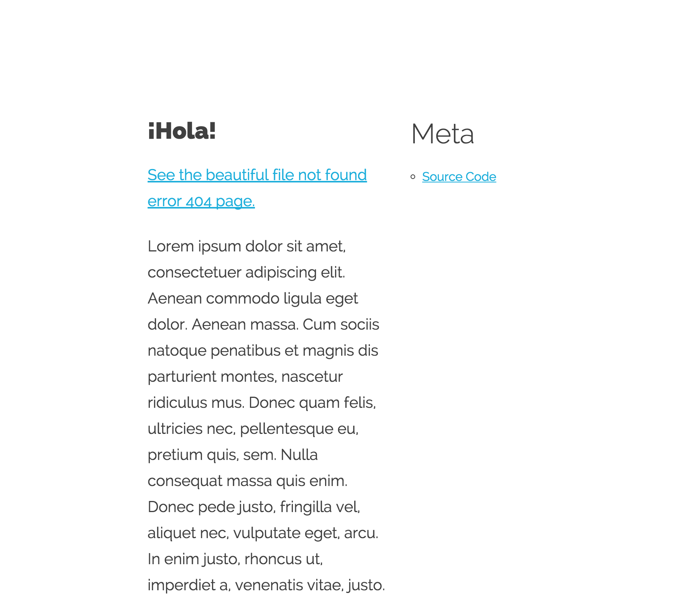

# Beautiful [Bottle](http://bottlepy.org/) Skeleton



* Very BASIC skeleton, no external python libraries required than 'bottle'
* Does not impose on or force you to develop your app in any particular way
* Example includes basic CSS, HTML boilerplate code, including Google Analytics Tracking

## Why?
Because there aren't enough Bottle skeleton web applications already in existence 
that look beautiful.

If you want a starting-point for your own experiments in making websites in Python, 
this isn't the worst place that you could start.  It was the starting point for the 
development of my [Beautifully Simple Static Bottle Blog Generator](https://github.com/vijinho/beautifully-simple-static-blog).

Check the [TODO.md](docs/TODO.md) or [ROADMAP.md](docs/ROADMAP.md) 
to see what's left to do and if you make some [CHANGES.md](docs/CHANGES.md) I'll be
sure to add you to the [CREDITS.md](docs/CREDITS.md) and [humans.txt](www/humans.txt) files.

## Easy Setup

* `pip install -r requirements.txt`
* Copy config file: `cp config.py.example config.py` - this is done automatically the first time [app.py](app.py) is run if the [config.py](config.py.example) file does not exist
* Edit [config.py](config.py.example) as needed
* Edit the page template in [views/index.tpl](views/index.tpl)

## Running

* `python app.py`
* Browse to localhost:8080

## config.py explained

```
CONFIG = {
    'debug': False,                  # debug mode
    'ga_code': 'UA-00000000-1',      # google analytics code UA-XXXX-Y
    'title': 'Welcome',              # name of the site
    'author': 'Vijay Mahrra'         # author of the site
}
```

## Credits

### CSS
* [normalize.css](http://necolas.github.io/normalize.css/) - CSS Reset
* [Skeleton](https://github.com/dhg/Skeleton/) CSS boilerplate
* [crem.in](https://github.com/kudos/crem.in/tree/master/css) - Blog CSS theme

### Images
* [html5boilerplate](https://html5boilerplate.com/) - Placeholder Images

### Other
* [Blind Text "Lorem Ipsum" Generator](http://www.blindtextgenerator.com/lorem-ipsum)

## Documentation

* Everything's in the [docs/](docs/) folder.
